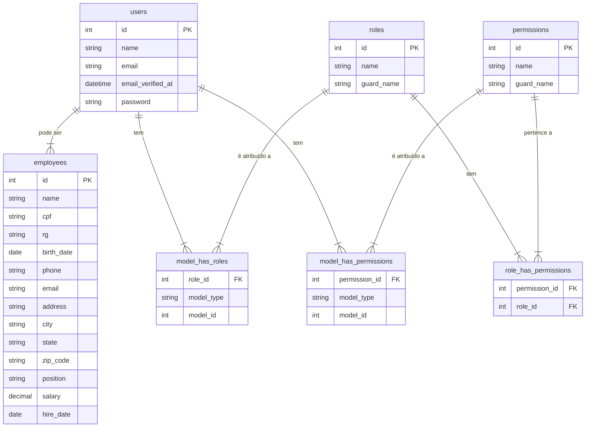
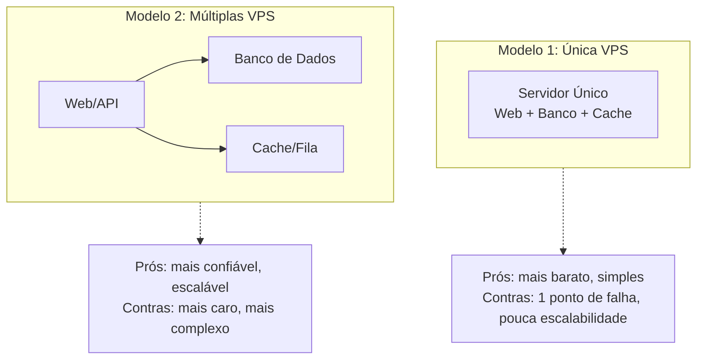

<div style="text-align: center;">  
    
</div>

# JLA ERP - Sistema de Gestão Integrada
**Aluno:** Dayvison Rocha Pereira

---

## 📋 Sumário

- [🚀 Introdução](#-introdução)
- [✨ Funcionalidades](#-funcionalidades)
- [🛠️ Ferramentas Utilizadas](#-ferramentas-utilizadas)
- [💿 Instalação](#-instalação)
  - [Localmente](#-instalação-local)
  - [Com Docker](#-instalação-docker)
- [🗄️ Modelo de Dados](#-modelo-de-dados)
- [⚙️ Módulos](#️-módulos)
  - [Controle de Acesso (Backpack)](#-controle-de-acesso-backpack)
  - [Funcionários](#-funcionários)
- [👨‍💻 Como Usar](#-como-usar)
- [📊 Arquiteturas Comparativo](#-arquiteturas-comparativo)

---

## 🚀 Introdução

O **JLA ERP** é um projeto de sistema de gestão integrada (ERP) desenvolvido como parte da atividade prática profissional do curso de Análise e Desenvolvimento de Sistemas. O objetivo é criar uma aplicação robusta e escalável para gerenciar diferentes aspectos de uma empresa, começando com o cadastro de funcionários e um sólido sistema de controle de acesso.

## ✨ Funcionalidades

- ✅ Painel administrativo completo para gestão de acesso.
- ✅ Gerenciamento de Usuários, Cargos e Permissões.
- ✅ Módulo para Cadastro de Funcionários com múltiplos campos.
- ✅ Interface responsiva e moderna.
- ✅ Instalação simplificada com Docker e Laravel Sail.

## 🛠️ Ferramentas Utilizadas

- **[Laravel](https://laravel.com/)**: Framework PHP para o backend.
- **[Laravel Backpack](https://backpackforlaravel.com/)**: Painel de administração para o Laravel.
- **[Spatie/laravel-permission](https://spatie.be/docs/laravel-permission/v6/introduction)**: Gerenciamento de cargos e permissões.
- **[Vue.js](https://vuejs.org/)**: Framework JavaScript para o frontend.
- **[Inertia.js](https://inertiajs.com/)**: Ponte de comunicação entre Laravel e Vue.
- **[Tailwind CSS](https://tailwindcss.com/)**: Framework de design CSS.
- **[PostgreSQL](https://www.postgresql.org/)**: Banco de Dados.
- **[Docker](https://www.docker.com/)**: Plataforma de contêineres.

## 💿 Instalação

Você pode instalar o projeto localmente ou utilizando Docker.

### 💿 Instalação Local

**Requisitos:**
- PHP ^8.2
- NodeJS v.22+
- Composer

**Passos:**
1.  Clone o repositório:
    ```bash
    git clone https://github.com/seu-usuario/jla_erp.git
    cd jla_erp
    ```

2.  Instale as dependências:
    ```bash
    composer install && npm install
    ```

3.  Configure o arquivo de ambiente:
    ```bash
    cp .env.example .env
    ```
    *   **Atenção:** Configure as variáveis de banco de dados (`DB_*`) no arquivo `.env`.

4.  Gere a chave da aplicação:
    ```bash
    php artisan key:generate
    ```

5.  Execute as migrações e os seeders:
    ```bash
    php artisan migrate --seed
    ```

6.  Inicie o servidor de desenvolvimento:
    ```bash
    npm run dev
    ```

7.  Em outro terminal, inicie o servidor do Laravel:
    ```bash
    php artisan serve
    ```

### 🐋 Instalação Docker

**Requisitos:**
- Docker
- Docker Compose

**Passos:**
1.  Clone o repositório:
    ```bash
    git clone https://github.com/seu-usuario/jla_erp.git
    cd jla_erp
    ```

2.  Configure o arquivo de ambiente. O Laravel Sail usará este arquivo para configurar os contêineres.
    ```bash
    cp .env.example .env
    ```
    *   **Atenção:** As variáveis de banco de dados no `.env` já estão pré-configuradas para o ambiente Docker do Sail (`pgsql`, `root`, `root`).

3.  Inicie os contêineres do Sail em background:
    ```bash
    ./vendor/bin/sail up -d
    ```

4.  Instale as dependências do Composer e NPM dentro do contêiner:
    ```bash
    ./vendor/bin/sail composer install
    ./vendor/bin/sail npm install
    ```

5.  Gere a chave da aplicação:
    ```bash
    ./vendor/bin/sail artisan key:generate
    ```

6.  Execute as migrações e seeders:
    ```bash
    ./vendor/bin/sail artisan migrate --seed
    ```

7.  Compile os assets do frontend:
    ```bash
    ./vendor/bin/sail npm run dev
    ```
    A aplicação estará disponível em [http://localhost](http://localhost).

## 🗄️ Modelo de Dados

O diagrama abaixo representa a estrutura do banco de dados, incluindo o controle de acesso do Spatie e os módulos customizados.

> 💡 **Dica:** Instale a extensão `marp-team.marp-vscode` no VSCode para visualizar o diagrama corretamente.



## ⚙️ Módulos

### 🛂 Controle de Acesso (Backpack)

O gerenciamento de acesso é feito através do painel administrativo do Laravel Backpack, acessível na rota `/admin`. Este painel oferece uma interface completa para gerenciar:

-   **Usuários:** Criar, editar e remover usuários do sistema.
-   **Cargos (Roles):** Definir diferentes papéis (ex: Administrador, Editor, Usuário).
-   **Permissões (Permissions):** Criar permissões granulares para ações específicas no sistema.

É possível atribuir cargos e permissões diretamente aos usuários, permitindo um controle de acesso flexível e seguro.

### 🧑‍💼 Funcionários

O módulo de funcionários permite o cadastro completo de colaboradores da empresa.

-   **Listagem e Busca:** Tabela com todos os funcionários, com campo de busca e paginação.
-   **Formulário Completo:** Um formulário dividido em 8 abas para organizar as informações:
    -   Dados Pessoais
    -   Endereço
    -   Documentos
    -   Dados Bancários
    -   Benefícios
    -   Dependentes
    -   Informações Adicionais
    -   Contrato
-   **Validações e Máscaras:** Campos como CPF, CEP e telefone possuem formatação automática.

## 👨‍💻 Como Usar

Após a instalação e execução do projeto, um usuário administrador é criado automaticamente.

-   **URL do Admin:** [http://localhost/admin](http://localhost/admin)
-   **Login:** `admin@admin.com`
-   **Senha:** `admin123`

Com este acesso, você pode navegar pelo painel do Backpack para gerenciar usuários e permissões, e também acessar o módulo de funcionários na área principal da aplicação.

## 📊 Arquiteturas Comparativo

Diagrama de arquitetura proposto durante a fase de planejamento do projeto.

