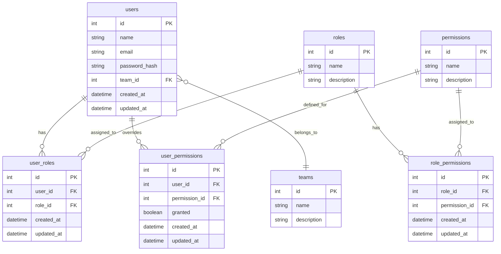

<div style="align: center;">  
    
</div>

# ESTÁGIO SUPERVISIONADO: ATIVIDADE PRÁTICA PROFISSIONAL
**Aluno:** Dayvison Rocha Pereira

### JLA ERP


### 📋 Sumário

  - [🚀 Introdução](#-introdução)
  - [🛠️ Ferramentas Utilizadas](#-ferramentas-utilizadas)
  - [ 💿 Instalação Local ](#-instalação-local)
  - [ 🐋 Instalação Docker ](#-instalação-docker)
  - [🗄️ Modelo de Banco Inicial](#-modelo-de-banco-inicial)
  - [⚙️ Módulos](#módulos)
    - [Funcionários](#funcionários)
      - [Funcionalidades Implementadas](#funcionalidades-implementadas)
      - [Como Usar](#como-usar)


### 🛠️ Ferramentas Utilizadas

- [Laravel](https://laravel.com/) - Framework PHP
- [Vue.js](https://vuejs.org/) - Framework JavaScript
- [Inertia.js](https://inertiajs.com/) - Framework ponte de comunicação entre Laravel e Vue
- [Tailwind CSS](https://tailwindcss.com/) - Framework CSS
- [PostgreSQL](https://www.postgresql.org/) - Banco de Dados
- [Lucide Icons](https://lucide.dev/) - Ícones
- [Shadcn UI](https://shadcn-vue.com/) - Componentes UI

### 💿 Instalação Local

**Requisitos:**
- NodeJS v.22
- PHP ^8.2

**1**. Clone o repositório:
```bash
  git clone
```

**2**. Instale as dependências do Laravel e do Vue:

```bash
  composer install && npm install
```

**3**. Crie um arquivo `.env` a partir do `.env.example` e configure as variáveis de ambiente, especialmente as de banco de dados.

```bash
  cp .env.example .env
```

**4**. Utilize o banco de dados local (Sqlite) ou da sua escolha:
>**OBS:** Se for `sqlite` basta deixar como o exemplo, se não só alterar
```dotenv
DB_CONNECTION=sqlite
# DB_HOST=pgsql
# DB_PORT=5432
# DB_DATABASE=laravel
# DB_USERNAME=root
# DB_PASSWORD=root
```

**5**. Gere a chave de aplicativo do Laravel:

```bash
  php artisan key:generate
```

**6**. Execute as migrações para criar as tabelas no banco de dados:

```bash
  php artisan migrate
```

**7**. Popule o banco de dados com dados iniciais (opcional):

```bash
  php artisan db:seed
```

### 🐋 Instalação Docker

**1**. Clone o repositório:
```bash
  git clone
```

**2**. Instale as depêndecias:
```bash
composer install && npm install
```

**3**. Navegue até o diretório do projeto:

```bash
  cd nome-do-repositorio
```

**4**. Crie um arquivo `.env` a partir do `.env.example` e configure as variáveis de ambiente, especialmente as de banco de dados.

```bash
  cp .env.example .env
```

**5**. Configure o `.env` com as variaveis do banco de dados (PGSQL é o que esta no docker-compose).
```dotenv
DB_CONNECTION=pgsql
DB_HOST=pgsql
DB_PORT=5432
DB_DATABASE=laravel
DB_USERNAME=root
DB_PASSWORD=root
```

**6**. O projeto contém o Laravel Sail, próprio para rodar o projeto, execute o comando abaixo, ele é semelhante ao `docker compose up -d`.
```bash
  ./vendor/bin/sail up -d 
```

**7**. Realize as migrations e seed:
```bash
  ./vendor/bin/sail artisan migrate --seed
```

**8**. Gere a chave da aplicação
```bash
    ./vendor/bin/sail artisan key:generate
```

**9**. Execute o vite:
```bash
    ./vendor/bin/sail npm run dev
```

### 🗄️ Modelo de Banco Inicial

Visando uma estrutura inicial para gerenciamento de Usuários, Times, Cargos e Permissões.

 > 💡 **Instale a extensão Mermaid para visualizar o diagrama ou veja na web.**



## ⚙️ Módulos

### Funcionários

O módulo de funcionários para seu sistema ERP está completo! Ele inclui todas as funcionalidades solicitadas:

#### Funcionalidades Implementadas

1. **Lista de Funcionários**
    - Visualização em tabela com busca
    - Ações para editar e excluir funcionários
    - Paginação para navegar entre resultados

2. **Sistema de Abas**
    - Navegação intuitiva entre as 8 categorias de informações
    - Cada aba contém os campos específicos solicitados

3. **Formulários Completos**
    - Todos os campos solicitados foram implementados
    - Campos obrigatórios e opcionais devidamente identificados
    - Formatação automática para CPF, CEP, telefone e valores monetários

4. **Gerenciamento de Dependentes**
    - Adição e remoção de dependentes
    - Campos para imposto de renda e plano de saúde

5. **Validações e Formatações**
    - Formatação automática de CPF, telefone, CEP
    - Busca de endereço por CEP integrada

6. **Interface Responsiva**
    - Layout adaptável a diferentes tamanhos de tela
    - Design moderno com Tailwind CSS

## Como Usar

1º - Login na Aplicação:
Com as seeds foi adicionado a contas:

> O acesso administrador permite acessar a rota `/admin`, visualizando uma seção do sistema que ainda esta em construção, onde é possivel cadastrar usuários, cargos, times, permissões e integrações.

**Administrador**
- Login: `admin@admin.com`
- Senha: `admin123`

> O acesso usuário é o acesso padrão, onde iniciará na tela `Início`, podendo navegar para o menu de `Funcionários`.

**Usuário** 
- Login: `user@user.com`
- Senha: `user123`

1. A tela inicial mostra a lista de funcionários cadastrados
2. Clique em "Novo Funcionário" para adicionar um novo registro
3. Use a barra de busca para encontrar funcionários específicos
4. Clique nos ícones de edição ou exclusão para gerenciar registros existentes
5. No formulário, navegue entre as abas para preencher todas as informações e salvar os funcionários no banco de dados.
